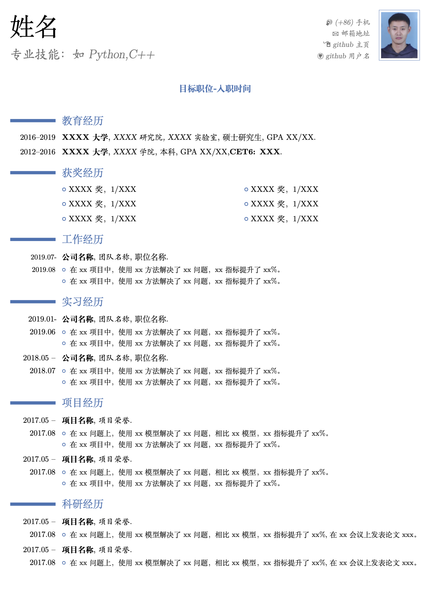

#  MyResume

## Repo Struct
```shell
├── Internship_en  # 英文版实习简历project
│   ├── main.tex   # 英文版实习简历源码
│   └── photo.png  # 英文版实习简历照片
├── Internship_zh  # 中文版实习简历project
│   ├── main.tex   # 中文版实习简历源码
│   └── photo.png  # 中文版实习简历照片
├── Job_en         # 英文版工作简历project
│   ├── main.tex   # 英文版工作简历源码
│   └── photo.png  # 英文版工作简历照片
├── Job_zh         # 中文版工作简历project
│   ├── main.tex   # 中文版工作简历源码
│   └── photo.png  # 中文版工作简历照片
├── ZhaoMingxing_BUPT_en.pdf # 最新英文版简历(编译结果)
├── ZhaoMingxing_BUPT_zh.pdf # 最新中文版简历(编译结果)
├── images         # 图片，用于README
│   └── resume_shortcut.png  # 简历模板截图
└── resume_template # 中文版工作简历模板project
    ├── main.tex    # 中文版工作简历模板源码
    └── photo.png   # 中文版工作简历模板使用的个人照片
```

## Quick Start
### For Mac users
To Use my latex resume source templates, 5 steps to go:
1. download and install basic mactex: [download from here](http://www.texts.io/support/0001/). 
1. config **TexShop** App as [configuration instruction](https://www.jianshu.com/p/7bbd54a89ac2).
1. clone this repo: `git clone https://github.com/igoingdown/MyResume.git`. 
1. go to project dir, like: `cd Job_zh`. 
1. edit latex file `main.tex` with **Texshop** pre-installed in the 1st step.
1. replace the picture `photo.png` by your own photo keeping the file name unchanged.
1. use `xelatex` to compile `main.tex`.
1. if no bugs in latex source file, you will get a resume named `main.pdf`. Congratulations!


### For Windows users
1. 使用WPS将我的简历pdf文档(`ZhaoMingxing_BUPT_en.pdf`或`ZhaoMingxing_BUPT_zh.pdf`)转为word
1. 使用WPS在word中修改排版字体和格式，换成自己的内容
1. 使用WPS将word文件导出为pdf就是你自己的简历啦！

## Examples

