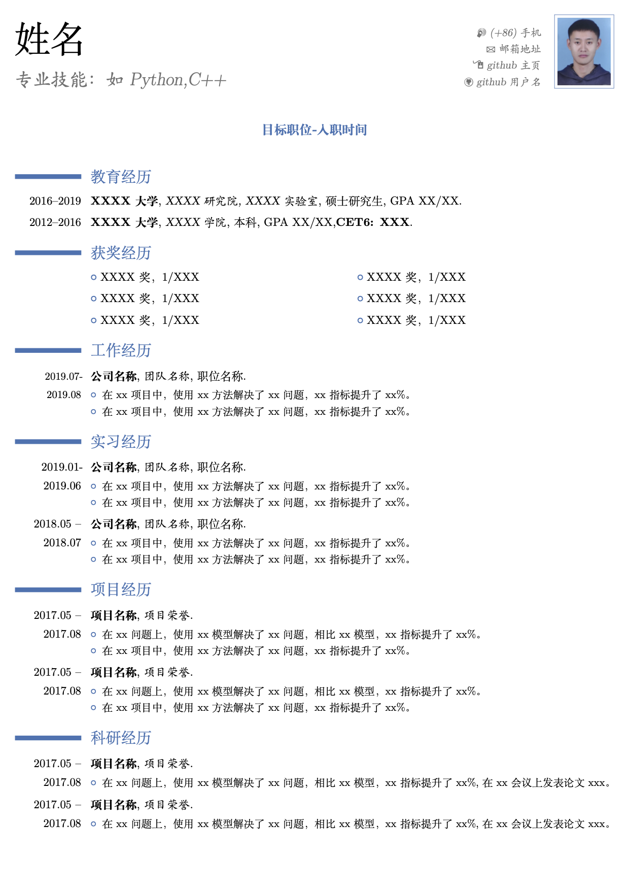

# MyResume

本仓库包含我的 LaTeX 简历工程，并提供一个可复用的中文简历模板（基于 `moderncv`）。

- 想复用模板：看 `resume_template/`
- 想查看我本人简历：看 `zhaomingxing_resume_for_job_zh/`（中文）和 `zhaomingxing_resume_for_job_en/`（英文）

## 目录结构

```text
.
├── docs/
│   └── images/                     # README 使用的图片
├── resume_template/                # 可复用：中文简历模板
│   ├── main.tex
│   └── photo.png
├── zhaomingxing_resume_for_job_zh/ # 我的中文简历
├── zhaomingxing_resume_for_job_en/ # 我的英文简历
└── template.pdf                    # 示例导出 PDF（可能不是最新）
```

## 环境依赖

- LaTeX 发行版（推荐安装完整套件，且包含 `xelatex`）
  - macOS：MacTeX
  - Windows：MiKTeX 或 TeX Live
  - Linux：TeX Live

说明：模板使用 `ctex`（中文）与 `moderncv`（样式），因此默认使用 XeLaTeX 编译。

## 快速开始（复用模板）

1) 克隆仓库

```bash
git clone git@github.com:igoingdown/MyResume.git
cd MyResume
```

2) 复制模板并修改内容

```bash
cp -R resume_template my_resume
```

编辑 `my_resume/main.tex`，并替换 `my_resume/photo.png`。

3) 编译生成 PDF

```bash
cd my_resume
xelatex main.tex
```

输出文件为 `my_resume/main.pdf`。如遇到交叉引用/目录未更新，建议再运行一次 `xelatex main.tex`。

如果安装了 `latexmk`（MacTeX/TeX Live 通常自带），也可以一键编译：

```bash
latexmk -xelatex main.tex
```

## 编译我的简历（中文/英文）

- 中文：

```bash
cd zhaomingxing_resume_for_job_zh
xelatex main.tex
```

- 英文：

```bash
cd zhaomingxing_resume_for_job_en
xelatex main.tex
```

## 预览



## 常见问题

- 报错 `moderncv.cls not found`：LaTeX 环境缺少 `moderncv` 包。建议安装完整发行版（MacTeX/TeX Live full），或用发行版自带的包管理器补齐。
- 中文乱码/字体报错：确认使用 `xelatex`（不要用 `pdflatex`），并确保系统安装了中文字体。
- 想清理编译产生的临时文件：在对应目录运行 `latexmk -c`。

## Personal Info

### 微信


### 微信公众号


### 邮箱

**Zhao Mingxing** - *[zhaomingxingdl@gmail.com](mailto:zhaomingxingdl@gmail.com)*
